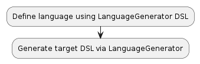
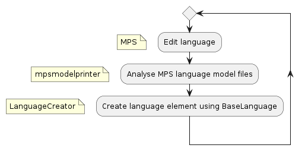

# Language Generator

A JetBrains MPS DSL to generate a DSL.

# How to use

In MPS, select the Console window and type the command
```
LanguageGenerator.createConcepts(#project.getRepository(), model-ptr/LanguageGenerator.sandbox/, module-reference/GeneratedLanguage/)
```


The first parameter 
```
#project.getRepository()
```
is a reference to the global repository.

The second parameter
```
model-ptr/LanguageGenerator.inputModels/
```
points to the input models.

The third parameter
```
module-reference/GeneratedLanguage/
```
points to the module where the generated language will be created.




# How to evolve LanguageGenerator itself

This is the workflow that I followed when I wanted to implement a new language feature in the LanguageGenerator application:



* Implement the feature using the MPS editor
* Run `mpsmodelprinter` and analyse the result
* Recreate the node structure of the language feature using BaseLanguage


# Status

Inspired by the [Cult of done Manifesto](https://medium.com/@bre/the-cult-of-done-manifesto-724ca1c2ff13), I am publishing this project even though it is not yet complete.

There is a lot of code that should point you in the right direction when you would like to so do yourself.

You'll need a fair bit of experience of working with JetBrains MPS, though.

# References

[MPS Model Printer](https://github.com/janradeck/mpsmodelprinter) : Pretty printer utility for JetBrains MPS language models
